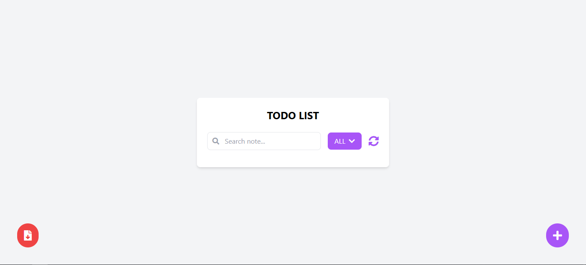

# TodoList

A simple Todo List application to manage your daily notes. Designed with a minimalist and user-friendly interface. You can easily search, categorize, and refresh your notes.

## Features

- 🔍 **Search:** Find notes by specific text.
- 🗂️ **Filter:** Group notes by the selected category.
- 🔄 **Refresh:** Quickly refresh the notes list.
- ➕ **Add Note:** Create a new note to add to the list.
- 📥 **Data Storage:** Data is saved locally on your device.

## Screenshot

## Technologies Used
**Frontend**: HTML, [Tailwindcss](https://tailwindcss.com/).

**Storage System**: Browser Storage (Local Storage or IndexedDB).

## License
This project is licensed under the [MIT License](https://opensource.org/license/mit).

